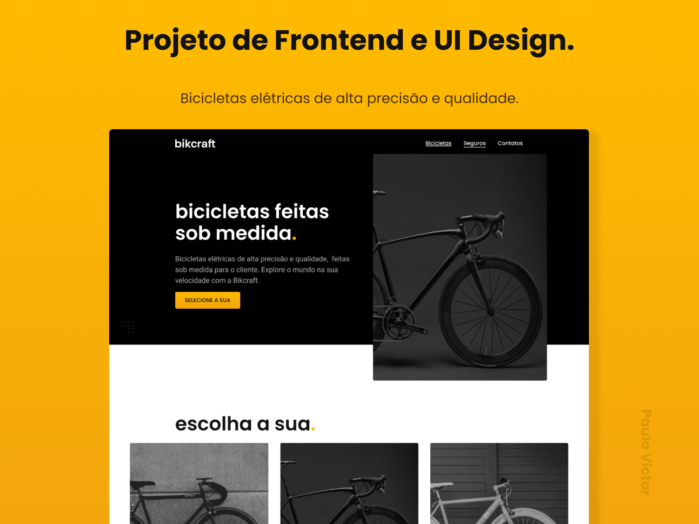

<a href="https://paulopbi.github.io/bikecraft/" target="_blank">
<strong>Site completo »</strong>
</a>

Bicicletas elétricas de alta precisão e qualidade, feitas sob medida para o cliente.

<a href="https://www.linkedin.com/in/paulopbi/" target="_blank">Linkedin</a> •
<a href="https://github.com/paulopbi" target="_blank">Github</a> •
<a href="https://www.behance.net/paulopbi" target="_blank">Behance</a> •
<a href="https://www.instagram.com/paulopbi_/" target="_blank">Instagram</a>

## Bikcraft

Cada Bikcraft é única e possui a sua identidade. As medidas serão exatas para o seu corpo e altura, garantindo maior conforto e ergonomia na sua pedalada. Você pode também personalizar completamente as suas cores.

Algumas vantagens de se ter uma bikcraft:

- Rastreador.
- Feitas com fibra de carbono.
- Atingem velocidades altas.

## Sobre o projeto

O codigo do site foi todo feito com **html**, **css**, **javascript** puro, o design foi feito com **figma**, a interface e bem completa, possuindo varias paginas internas, **sendo 100% responsivo** a todos os tamanhos de telas, formularios bem complexos e personalizados e muitas outras coisas.  

<small>gif de demonstracao</small>

o projeto esta hospedado no github pages, voce pode ver mais <a href="https://paulopbi.github.io/bikecraft/" target="_blank">clicando aqui</a>.

## Aprendizados
O que eu aprendi com esse projeto?

### Codigo

- Manipulacao do DOM
- Pseudo-elementos e Pseudo-Classes
- Positions
- Display grid e flexbox
- Responsividade
- Criar um utility first
- Otimizacao
- NPM
- Usar plugins para animacao
- Seletores css (como: ~, +, >, *, etc...)
- Git

### Design

- UX Experience
- UI Design
- Figma
- Teoria das cores
- Tipografia
- Design Responsivo
- Design System

## Tecnologias utilizadas

## Contato

Meu email: paulovictordev16@gmail.com

Muito obrigado por ver o meu projeto!

(<a href="#top">Voltar ao inicio</a>)
